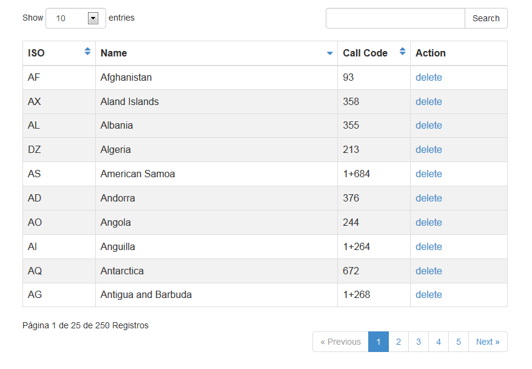
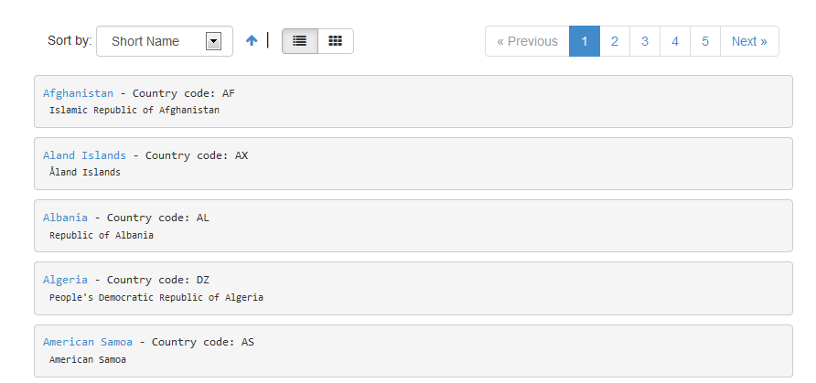

teaPagination
=============

teaPagination is a script that allows you to paginate a sql statement or an array of data, is powerful and flexible as it has all the functionality to page any data you want.

Installation
------------
<ol>
<li>Unzip the file on the server root</li>
<li>Included in their projects teaPagination.php file. 
  
<pre>&lt;?php require('your/path/teaPagination.php'); ?&gt;</pre>
 
</li>
<li>Open in folder examples setting/setting.php and write your data connection to the database</li>
<li>Execute countries.sql in your database.</li>
<li>If you use the ajax page should include jquery plugin that is disposed within the header labels html document.
   
<pre>&lt;script src="your/path/teaPaginate.js" type="text/javascript"&gt;&lt;/script&gt;</pre>
 
</li>
</ol>

Features
--------
<ol>
<li>Easy to use, with a few lines of code get great results</li>
<li>Url and Ajax Pagination</li>
<li>Allows friendly url</li>
<li>The list is customizable</li>
<li>It is very extensible</li>
<li>has added a jquery plugin to interact with the server in the most simple</li>
</ol>

How to use
----------

Before initializing the object must have prepared the data, which can be an array or sql query already formed.

<pre>$data = 'Select * from countries'; /*or*/ $data = array('a','b','c','d');</pre>

Set options for pagination

<pre>$options = array();</pre>
<table><tr><td style="width:20%">Option</td><td style="width:50%">Description</td><td>Default Value</td></tr>
<tbody>
    <tr><td>maxButtons (integer)</td><td>Sets the number of buttons to display</td><td>5</td></tr>
    <tr><td>itemsPage (integer)</td><td>Number of rows to display</td><td>5</td></tr>
    <tr><td>beginLoop (string)</td><td>Sets string to the begin of the loop</td><td>NONE</td></tr>
    <tr><td>endLoop (string)</td><td>Sets string to the end of the loop</td><td>NONE</td></tr>
    <tr><td>beginTagItem (string)</td><td>Sets a string at the beginning of the iteration</td><td>NONE</td></tr>
    <tr><td>endTagItem (string)</td><td>Sets a string at the end of the iteration</td><td>NONE</td></tr>
    <tr><td>ajax (boolean)</td><td>It does not show the button link page</td><td>false</td></tr>
    <tr><td>nameVar (string)</td><td>Parameter name containing the page number</td><td>page</td></tr>
    <tr><td>urlPage (string)</td><td>Allows you to customize the output url</td><td>NONE</td></tr>
    <tr><td>textNotFound (string)</td><td>Text to be displayed when the data list is empty</td><td>Not found Record.</td></tr>
    <tr><td>connect_db (array)</td><td>This option sets the connection parameters to the database:<ol><li>user: name user</li><li>database: name database</li><li>password</li></ol></td><td>array('user' =&gt; '','database' =&gt; '','password' =&gt; '')</td></tr>
    <tr><td>buttons (array)</td><td>Customize output buttons:
            <ol>
                <li>btNext(boolean): Display the next button</li>
                <li>btNextTitle(string): Set button text</li>
                <li>btPrevious(boolean): Display the previous button</li>
                <li>btPreviousTitle(string): Set button text</li>
                <li>btFirst (boolean): Display first button</li>
                <li>btFirstTitle(string): Set button text</li>
                <li>btLast(boolean): Display last button</li>
                <li>btLastTitle(string): Set button text</li>
                <li>class(string): Define button styles</li>
            </ol></td><td>array('btNext' =&gt; true,'btNextTitle' =&gt; 'Next »','btPreviousTitle' =&gt; '« Previous','btPrevious' =&gt; true,'btLastTitle' =&gt; 'Last','btLast' =&gt; true,'btFirstTitle' =&gt; 'First','btFirst' =&gt; true,'class' =&gt; '')</td></tr>
</tbody>
</table>

Create an instance of the class

<pre>$pagination = new teaPagination($data, $options);</pre>

Create the list using the loop method

<pre>$pagination-&gt;loop($item_design, $callback=null, $callArgs=array());</pre>

<b>$item_design</b> is a string that replaces a word key by the value obtained from the data source. For example, if you have a field named 'lastName' that it replaced by its value chain adding the word {lastName}.
    <b>$callback</b> is a name function for display a more complete list, so calling an external function that will be called for each iteration of data. For example, to obtain a list of active users from the data source:

<pre>function create_list($data){if($data['user'] == 'active')return '&lt;div&gt;'.$data['name'].'&lt;/div&gt;';}</pre>

And finally display the list and buttons

<pre>echo $pagination-&gt;render(); /* list */ echo $pagination-&gt;buttons(); /* buttons */</pre>
<h3>Public variables:</h3>
<ul>
    <li><b>currentPage</b>: returns the current page number</li>
    <li><b>TotalPage</b>: returns total pages of the list</li>
    <li><b>TotalRecord</b>: returns total records of the list</li>
</ul>

JavaScript
----------

For ajax paging to use the plugin for jquery teaPaginate.js, add the following line of code between the head tags in html document:

<pre>&lt;script src="your/path/teaPaginate.js" type="text/javascript"&gt;&lt;/script&gt;</pre>

Now create the object for manipulation

<pre>var element = document.getElementById('example');
var paginateExample = new teaPaginate(element,{    
    url : server.php,
    buttonsContainer : 'nameElement',
    OnLoad : handlePagerSuccess,
    OnBefore: handlePagerBefore,
    textLoading: 'Loading...',
    data:{page:1,init:true}
}).init();
</pre>
 
<h3>Options:</h3>
<ul>
    <li><b>url</b>: url server</li>
    <li><b>buttonsContainer</b>: element that contains the buttons</li>
    <li><b>OnLoad</b>: processed function call after loading the list</li>
    <li><b>OnBefore</b>: processed function call before loading the list</li>
    <li><b>textLoading</b>: alternative text during the loading process</li>
    <li><b>data</b>: data sent to the server for processing (POST request)</li>
</ul>
<h3>Methods:</h3>
<ul>
    <li><b>update({data{options}})</b>: update the current page number (making a call to the server), data is sent (POST) to the server for processing.</li>
    <li><b>currentPage()</b>: return current page</li>
</ul>
		